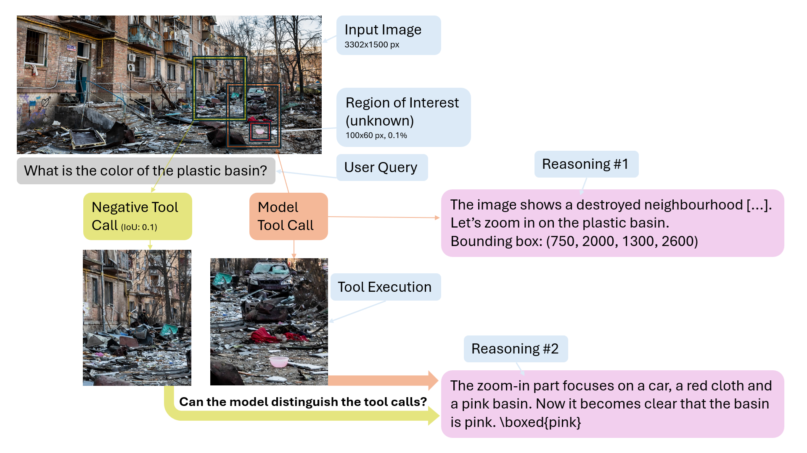

<p  align="center">
  
</p>

# Learning to Zoom Efficiently with a Contrastive Curriculum

## Overview

This repository provides the code for our paper [Learning to Zoom Efficiently with a Contrastive Curriculum](https://arxiv.org/abs/2609.03206), accepted to EMNLP 2026.
It contains code to recreate our proposed M&C dataset and run training and evaluation to reproduce our results. Our trained models can be found on [huggingface](https://huggingface.co/collections/UKPLab/zoom-in) and should be evaluated with the code from this repo.

## Setup
First, do ``pip install --no-deps -r requirements.txt`` in python 3.12, followed by `pip install --no-build-isolation flash-attn==2.7.4.post1`.

## Dataset construction
Note: Due to copyright issues we can not distribute the dataset directly. You need to rebuild it.

For construction of the M&C dataset, do

`
generate_synthetic_grid_data.py --download_dir=/image/download/path --save_path_prefix=/save/path/generated/splits
`

which downloads the source images into `download_dir`, preprocesses them, generates image grids and finally generates textual questions for the 
M&C VQA dataset which are saved under `save_path_prefix`. The image grid generation takes several hours but can be resumed.

## Data format

Training and evaluation read datasets in one **canonical format**: a JSONL file plus a
separate image folder. Each line is one example:

```json
{"problem": "<full question text>", "image": "img_0.png", "solution": "A"}
```

- `problem`: the complete question text (any multiple-choice options are already part of it).
- `image`: a filename **or** a list of filenames, relative to the `--image_folders` / `--image_filepath` argument.
- `solution`: the gold answer as a string, or a list of strings.
- extra keys (e.g. `bbox`) are passed through unchanged.

Point the scripts at the JSONL with `--data_file_paths` / `--data_filepath` and at the image
folder with `--image_folders` / `--image_filepath` (during training, use `:` to combine several
datasets). The M&C generator above already emits this format, so its output is used directly.

The other (third-party) benchmarks are fetched and converted to the canonical format with
`download_data.py`, e.g.

```
python download_data.py --dataset hr_bench_4k --out_dir /data/hr_bench_4k
python download_data.py --dataset mme --out_dir /data/mme --max_shards 1   # partial download of a sharded set
```

Supported `--dataset` values: `hr_bench_4k`, `hr_bench_8k`, `mme`, `mme_lite`,
`pixel_reasoner`, `pixel_reasoner_vstar`, `visual_probe_train`, `deepeyes_train_4k`. For V* we use
PixelReasoner's packaging (original: `craigwu/vstar_bench`). Dataset layouts vary between releases,
so verify the produced `test.jsonl` before a full run — a partial download (`--max_shards 1`) is
enough to check the format.

## Training environment: CUDA toolkit & DeepSpeed

DeepSpeed (ZeRO-3 + CPU-Adam) JIT-compiles CUDA ops at training start, so the env needs an `nvcc`
matching your PyTorch CUDA build (12.4, pinned in `requirements.txt`) plus a compiler. conda is the
easiest rootless way; system CUDA / `module load` / a CUDA-devel image work too:
```
conda install -c conda-forge gxx_linux-64=14.3.0
conda install --override-channels -c nvidia/label/cuda-12.4.1 cuda-toolkit=12.4.1 cuda-nvcc cuda-cudart-dev
nvcc --version   # must report 12.4, not 13.x
```
`--override-channels` and the pinned version are required — otherwise conda pulls CUDA 13.x from
`defaults` and `nvcc` won't match. Then export these (persist via `conda env config vars set`, since
`train_scheduler.py` starts `trl vllm-serve` before any Python runs):
```
export CUDA_HOME=$CONDA_PREFIX
export LIBRARY_PATH=$CONDA_PREFIX/lib:$LIBRARY_PATH
export LD_LIBRARY_PATH=$CONDA_PREFIX/lib:$LD_LIBRARY_PATH
export TORCH_EXTENSIONS_DIR=$CONDA_PREFIX/deepspeed_torch_extensions
```
Verify with `python -c 'import deepspeed; deepspeed.ops.op_builder.CPUAdamBuilder().load()'`.

## Training
**Requirements:** the scheduler uses GNU `screen` (install with `sudo apt install screen`, or
without root via `conda install -c conda-forge screen`) and assumes a single 8-GPU node (GPU 0
serves vLLM, GPUs 1–7 run training). It launches two detached background sessions per run —
`<shell>_auto_vllm` (vLLM server) and `<shell>_auto_run` (trainer) — and then polls until training
finishes; you don't need to interact with them. To watch progress, either `tail -f` the
`vllm_log.txt` / `run_log.txt` files in the run's output directory, or attach with `screen -r <name>`
(detach again with `Ctrl-A` then `D`).

To start the training, specify the script in `train_scheduler.py` and execute it 

``
train_scheduler.py
``

Sample scripts are given in the `scripts` directory but the paths need to be adapted to your setup.
## Evaluation

Evaluation is driven by `initiate_analysis.py` and a JSON config in `configs/eval/`
(see `configs/eval/sample_config.json`). To run the evaluations defined in a config:

```
python initiate_analysis.py --config_path configs/eval/<your_config>.json --evaluate
```

The config describes the model and the datasets, plus a grid of evaluation settings. Key fields:

- `model_path`, `model_class` (currently `Qwen/Qwen2.5-VL-7B-Instruct`), `short_name`, and optional `output_path` (defaults to `model_path`).
- `dataset_name`: a list of `{"name", "path"}` dicts. For the third-party benchmarks, `path` is the
  `download_data.py --out_dir` (which holds `test.jsonl` + images). For the M&C dataset, use
  `"name": "muffin_chihuahua"` with `path` = the generated splits dir and the lists `grid_pixels`,
  `gridsize`, `mode` (`single_cell_query` / `find_outlier`) — these expand into one eval per grid config.
- `tool_config_type`: e.g. `no_tool`, `zoom_in_absolute` (for Pixel-Reasoner: `PR_crop_image_normalized,select_frames`).
- outcome-relevant knobs: `max_pixels`, `min_pixels`, `bbox_type`, `strict_tool_extraction`,
  `tool_padding`, `max_tokens_per_reply`, `temperature`, `num_generations`.

Every field marked as a list is expanded over the Cartesian product, so a single config can launch
many evaluations. Use `--exist_behaviour {raise,overwrite,skip}` to control what happens when an
eval's output already exists. Each run writes its raw outputs (`full_results.json`, `command.txt`,
tool-call artifacts) under the model's output directory. See `python initiate_analysis.py --help`
for the full field list.

## Model analysis

Once evaluations have run, aggregate them into a metrics table:

```
python initiate_analysis.py --config_path configs/eval/<your_config>.json --analyse \
    --metrics accuracy avg_pixel_reasoning zoom_in_fraction_median
```

`--analyse` reads each eval's `full_results.json` and prints a CSV table with one row per eval
(you can pass `--evaluate --analyse` together to do both). Commonly used `--metrics` are
`accuracy`, `accuracy_if_tool_used` / `accuracy_if_tool_not_used`, `avg_pixel_reasoning` (mean tool
uses), `pixel_reasoning_distr`, `avg_first_completion_len` / `avg_total_completion_len`,
`zoom_in_fraction_median`, `tool_success_rate`, and the localization metrics `ious` / `iou_std`,
`precision` / `recall` (with `_std`). If `--metrics` is omitted a sensible default set is used; the
full list is documented in `--help`.

## Contact
Responsible person: Falko Helm — [falko.helm@tu-darmstadt.de](mailto:falko.helm@tu-darmstadt.de) · GitHub: [falko1](https://github.com/falko1)

Affiliations: 
- UKP Lab: https://www.informatik.tu-darmstadt.de/ukp/ukp_home/index.en.jsp
- TU Darmstadt: https://www.tu-darmstadt.de/
- Hessian AI: https://www.hessian.ai/
- JAIF: https://www.fz-juelich.de/en/jsc/jupiter/jaif-jupiter-ai-factory

If you find this repo helpful, please consider citing us:

```bibtex
@inproceedings{helm_zoom_in_2026,
  title     = {Learning to Zoom Efficiently with a Contrastive Curriculum},
  author    = {Helm, Falko and Gurevych, Iryna},
  booktitle = {Proceedings of the 2026 Conference on Empirical Methods in Natural Language Processing (EMNLP)},
  year      = {2026}
}
```

## Acknowledgements
The code was adapted from https://github.com/om-ai-lab/VLM-R1.

## Disclaimer
This repository contains experimental software and is published for the sole purpose of giving additional background details on the respective publication. 
